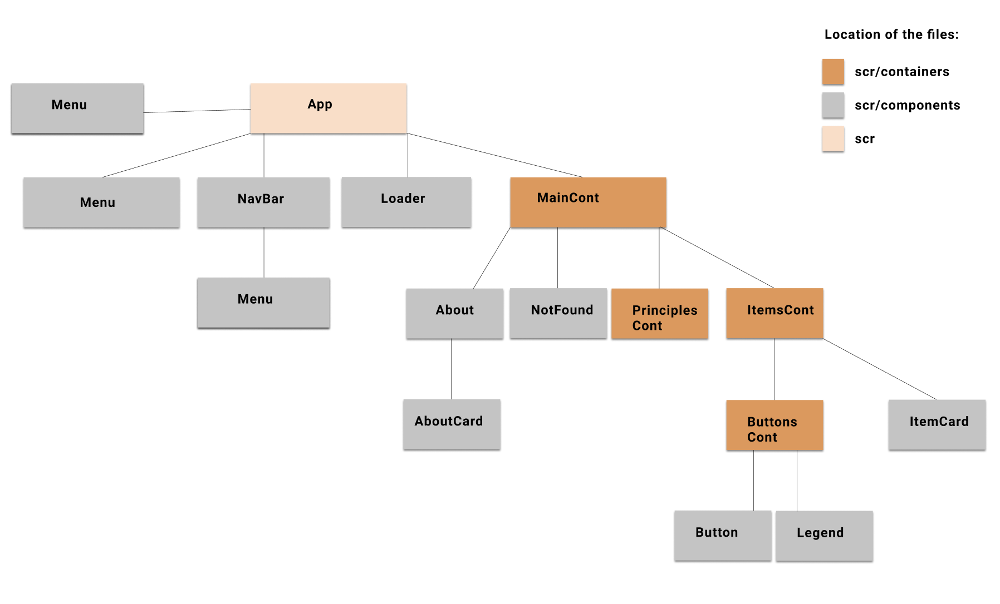

# Feminist Covid-19 Response

A volunteer online data repository of information on feminist principles and actions, as well as policy responses to the COVID crisis.

Explore online: <http://feministcovidresponse.com/>

***

## Table of contents
- [Getting Started](#getting-started)
    - [Node Installation on OS X](#node-installation-on-os-x)
    - [Node Installation on Linux](#node-installation-on-linux)
    - [Node Installation on Windows](#node-installation-on-windows)
- [Installation](#installation)
- [Start and Watch](#start-and-watch)
- [Component hierarchy](#component-hierarchy)
- [Languages and tools](#languages-and-tools)
    - [Frontend framework: React](#react)
    - [Localization: i18next](#i18next)
    - [Analytics: react-ga ](#react-ga)
- [What are you trying to do?](#what-are-you-trying-to-do)
    - [Change the wording of 'About' section](#change-about-section)
    - [Change the wording of 'Principles' section](#change-principles-section)
    - [Update the wording of 'Legend' on response tracker](#update-legend)
    - [Update the wording of 'Menu' items, types, categories or countries](#update-translation)
- [Contributing](#contributing)
    - [Known Issues](#known-issues)
- [License](#license)

---

## Getting Started
For development, you will only need [Node.js](http://nodejs.org/) installed on your environement. 

#### Node installation on OS X

You will need to use a Terminal. On OS X, you can find the default terminal in
`/Applications/Utilities/Terminal.app`.

Please install [Homebrew](http://brew.sh/) if it's not already done with the following command.

    $ ruby -e "$(curl -fsSL https://raw.github.com/Homebrew/homebrew/go/install)"

If everything when fine, you should run

    brew install node

#### Node installation on Linux

    sudo apt-get install python-software-properties
    sudo add-apt-repository ppa:chris-lea/node.js
    sudo apt-get update
    sudo apt-get install nodejs

#### Node installation on Windows

Just go on [official Node.js website](http://nodejs.org/) & grab the installer.
Also, be sure to have `git` available in your PATH, `npm` might need it.


## Installation

```
    $ git clone https://github.com/sruti/covid19-riskfactors-app.git
    $ cd covid19-riskfactors-app
    $ npm install
```

## Start and Watch

```
    $ npm start
```
---

## Component Hierarchy 


---
## Languages and Tools

### React

- [Create React App](https://github.com/facebook/create-react-app).

### i18next

- [React-i18next](https://react.i18next.com/)

### react-ga

- [React-i18next](https://github.com/react-ga/react-ga)

---
## What are you trying to do?
This section is entirely devoted to the folks who are not developers or are not used to working with JS frameworks. So, what are you trying to do:
- [Change the wording of 'About' section](#change-about-section)
- [Change the Thank Yous](#change-thank-yous)
- [Change the pdfs](#change-pdfs)
- [Change the wording of 'Principles' section](#change-principles-section)
- [Update the wording of 'Legend' on response tracker](#update-legend)
- [Update the wording of 'Menu' items, types, categories or countries](#update-other-text)

### Change About Section
In order to change "About" Section, please navigate to `src/components/About.js`. You will see that in the place of a standard paragraph, we have the `i18next` syntax, for example:

```html
   <p className="about-intro">{t("intro")} </p>
```

This site was built with localization in mind, meaning, it is available in three language versions. In order to change this paragraph, you will work with any or all of these three files, each one is responsible for a different language version: 
- `public/locales/en/about.json`, 
- `public/locales/es/about.json`, and 
- `public/locales/fr/about.json`. 

Next, look for the key `intro` and make changes in the corresponding value.

If you want to add additional text on the page, follow this steps:
0. Change the branch to `dev`;
1. Add the html tag in `About.js`;
2. Instead of pasting the contents in the tag itself, use a descriptive key and write it in the `i18next` syntax: `{t("your-key")}`;
3. Navigate to the three files and add the key, together with the text you want it to denote as the key's value -- order does not matter, you can just put it at the end or in the middle;
**_Remember_**: If you add only the English translations, then in the French and Spanish version of the page the English paragraph will be rendered.
4. Update the files (either on github, or if you are a developer, then just push a commit) and inform the maintainer about the change.

### Change Principles Section
In order to change "Thank you" list (that appears in the About section), follow these steps:

0. Change the branch to `dev`;
1. Navigate to `scr/assets/data/appreciation.js`. You will see three variables:
- `database` - these are the database volunteers;
- `coordination` - these are the coordinators;
- `orgs` - these are the NGOs and individuals.
2. Add the name to the appropriate variable following the pattern you see:
- it needs to be in the quotation marks (""),
- if there's another name before it or after it, **remember to add the comma (,)**. 
_NOTE_: The order matters!
3. Update the files (either on github, or if you are a developer, then just push a commit) and inform the maintainer about the change.

### Change PDFs
In order to change the PDFs (that appear in the Principles section), follow these steps:
0. Change the branch to `dev`;
1. Navigate to `scr/assets/files`;
2. Copy the name and delete the file you no longer need;
3. Add the new file -- make sure to name it exactly the same as the deleted file;
3. If you are a developer, then just push a commit, and inform the maintainer about the change.

### Change Principles Section
In order to change "Principles" Section, please navigate to `src/containers/PrincipleContainer.js`. You will see that in the place of a standard paragraph, we have the `i18next` syntax, for example:

```html
   <h1 className="principles-title">{t("title")}</h1>
```

This site was built with localization in mind, meaning, it is available in three language versions. In order to change this paragraph, you will work with any or all of these three files, each one is responsible for a different language version: 
- `public/locales/en/princ.json`, 
- `public/locales/es/princ.json`, and 
- `public/locales/fr/princ.json`. 

Next, look for the key `title` and make changes in the corresponding value.

If you want to add additional text on the page, follow this steps:
0. Change the branch to `dev`;
1. Add the html tag in `PrinciplesContainer.js`;
2. Instead of pasting the contents in the tag itself, use a descriptive key and write it in the `i18next` syntax: `{t("your-key")}`;
3. Navigate to the three files and add the key, together with the text you want it to denote as the key's value -- order does not matter, you can just put it at the end or in the middle;
**_Remember_**: If you add only the English translations, then in the French and Spanish version of the page the English paragraph will be rendered.
4. Update the files (either on github, or if you are a developer, then just push a commit) and inform the maintainer about the change.

### Update the legend

In order to change "Legend" section on the Response Tracker, please navigate to `src/components/Legend.js`. You will see that in the place of a standard paragraph, we have the `i18next` syntax, for example:

```html
   <p className="legend-types-p">{t("TYPES")}:</p>
```

This site was built with localization in mind, meaning, it is available in three language versions. In order to change this paragraph, you will work with any or all of these three files, each one is responsible for a different language version: 
- `public/locales/en/legend.json`, 
- `public/locales/es/legend.json`, and 
- `public/locales/fr/legend.json`. 

Next, look for the key `TYPES` and make changes in the corresponding value.

If you want to add additional text on the page, follow this steps:
0. Change the branch to `dev`;
1. Add the html tag in `Legend.js`;
2. Instead of pasting the contents in the tag itself, use a descriptive key and write it in the `i18next` syntax: `{t("your-key")}`;
3. Navigate to the three files and add the key, together with the text you want it to denote as the key's value -- order does not matter, you can just put it at the end or in the middle;
**_Remember_**: If you add only the English translations, then in the French and Spanish version of the page the English paragraph will be rendered.
4. Update the files on github (or if you are a developer, then just push a commit) and inform the maintainer about the change.

### Update other text

In order to change any other text, please navigate to its component file. You will see that in the place of a standard paragraph, we have the `i18next` syntax, for example:

```html
   <p className="legend-types-p">{t("TYPES")}:</p>
```

This site was built with localization in mind, meaning, it is available in three language versions. In order to change this paragraph, you will work with any or all of these three files, each one is responsible for a different language version: 
- `public/locales/en/translation.json`, 
- `public/locales/es/translation.json`, and 
- `public/locales/fr/translation.json`. 

Next, look for the `TYPES` key and make changes in the corresponding value.

If you want to add additional text on the page, follow this steps:
0. Change the branch to `dev`;
1. Add the html tag in the correct component;
2. Instead of pasting the contents in the tag itself, use a descriptive key and write it in the `i18next` syntax: `{t("your-key")}`;
3. Navigate to the three files and add the key, together with the text you want it to denote as the key's value -- order does not matter, you can just put it at the end or in the middle;
**_Remember_**: If you add only the English translations, then in the French and Spanish version of the page the English paragraph will be rendered.4. Update the files (either on github, or if you are a developer, then just push a commit) and inform the maintainer about the change.

--- 

## Contributing
Pull requests are welcome. Please make sure that your PR is [well-scoped](https://www.netlify.com/blog/2020/03/31/how-to-scope-down-prs/).
For major changes, please open an issue first to discuss what you would like to change. 

### Known issues
Visit [issues](https://github.com/wedo-org/feministcovidresponse/issues) section.

### Contributors
<table>
    <tr>
        <td align="center">
            <a href="https://github.com/sylwiavargas">
                
                <br />
                <sub><b>Sylwia Vargas</b></sub>
            </a><br />
            <a href="https://github.com/wedo-org/feministcovidresponse/commits?author=sylwiavargas" title="Code">💻</a> 
            <a href="https://github.com/wedo-org/feministcovidresponse/issues?q=is%3Aissue+author%3Asylwiavargas+" title="Bug reports">🐛</a>
            <a href="https://github.com/sruti/covid19-riskfactors-app/commits/master/README.md" title="Documentation">📖</a>
            <a href="#ideas-sylwia" title="Ideas, Planning, & Feedback">💡</a>
        </td>
        <td></td>
        <td align="center">
            <a href="http://sruti.me/">
                
                <br />
                <sub><b>Annie Souza</b></sub>
            </a><br />
            <a href="https://github.com/wedo-org/feministcovidresponse/commits?author=luanesouza" title="Code">💻</a> 
            <a href="https://github.com/wedo-org/feministcovidresponse/issues?q=is%3Aissue+luanesouza+" title="Bug reports">🐛</a>
            <a href="#infra-annie" title="Infrastructure (Hosting, Build-Tools, etc)">🚇</a> 
            <a href="#ideas-annie" title="Ideas, Planning, & Feedback">💡</a>
        </td>
    </tr>
</table>


## License
[MIT](https://choosealicense.com/licenses/mit/)
